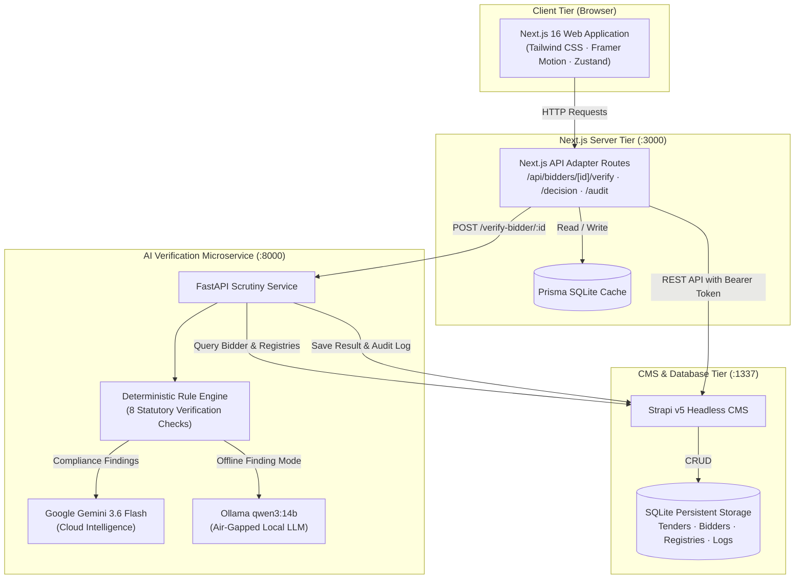

# AI-Powered Bid Compliance Verification Platform
> **Smart India Hackathon (SIH26100)** · Automated Government Procurement Tender Scrutiny, Multi-Registry Verification, and AI-Driven Risk Assessment.

---

## 📑 Table of Contents
1. [The Problem & The Solution](#-the-problem--the-solution)
2. [Detailed Technology Stack](#-detailed-technology-stack)
3. [System Architecture & Data Flow](#-system-architecture--data-flow)
4. [What Is Built & Functional (Present)](#-what-is-built--functional-present)
5. [What Is Not Present & Production Roadmap (Gaps & Limitations)](#-what-is-not-present--production-roadmap-gaps--limitations)
6. [Simulated Statutory Registries](#-simulated-statutory-registries)
7. [Quick Start Guide (Local & Docker)](#-quick-start-guide-local--docker)
8. [Local Ollama Setup (qwen3:14b)](#-local-ollama-setup-qwen314b)
9. [Evaluation Demo Walkthrough](#-evaluation-demo-walkthrough)
10. [Repository Structure](#-repository-structure)

---

## 🎯 The Problem & The Solution

### ❌ The Problem
In government procurement (e.g. **GeM - Government e-Marketplace**, **CPPP - Central Public Procurement Portal**, State e-Procurement):
- **Weeks of Manual Scrutiny**: Technical and legal evaluation of hundreds of bidder applications takes weeks of manual checks by procurement officers.
- **Fragmented Portals**: Officers must manually log into 8+ disparate government portals (GSTN, Traces/Income Tax, Udyam, EPFO Shram Suvidha, ESIC, DPIIT, NSIC, Central Debarment registers) for every single bidder.
- **Fraud & Cartelization**: Fraudulent entities slip through using cancelled GSTINs, forged MSME exemptions, expired startup recognition, or by bidding under sister companies while debarred.
- **Human Error & Bias**: Fatigue-induced mistakes and subjective decisions result in litigation, tender cancellations, and audit objections from CAG / CVC.

### ✅ The Solution
An autonomous **procurement compliance & risk evaluation platform** that automates technical scrutiny end-to-end:
1. **Instant Multi-Registry Cross-Examination**: Programmatically queries all 8 statutory databases in parallel within seconds.
2. **Deterministic, Tamper-Proof Rule Engine**: Evaluates statutory compliance using hardcoded legal rules (not probabilistic LLM guesses), calculating an objective Compliance Score (0–100) and Risk Tier (Low, Medium, High, Critical).
3. **Dual AI Intelligence (Cloud or Local Offline)**:
   - **Google Gemini 3.6 Flash**: Synthesizes complex multi-registry findings into succinct legal and technical summaries.
   - **Local Ollama (`qwen3:14b`)**: Provides 100% air-gapped, sovereign, offline AI evaluation for confidential defense and sensitive government procurements.
4. **Officer Decision Workbench**: An intuitive interface where procurement officers can inspect discrepancies, issue clarification notices, or finalize qualification with full human oversight.
5. **Immutable Audit Trail**: Chronologically logs every API request, timestamp, score calculation, and officer sign-off for transparency.

---

## 💻 Detailed Technology Stack

The platform is engineered as a decoupled, multi-tier microservices architecture:

### 1. Frontend Layer (Next.js & UI Architecture)
- **Framework**: **Next.js 16 (Turbopack, App Router)** with Server Components and dynamic Route Handlers.
- **Library**: **React 19** with client-side state hooks.
- **Styling & Design System**: **Tailwind CSS v4** with PostCSS and responsive layout utilities.
- **Animations & Interaction**: **Framer Motion 12** powering the real-time live scanner overlay, accordion transitions, and status badges.
- **State Management**: **Zustand 5** for lightweight, reactive officer state, filters, and active bidder context.
- **UI Components**: **Radix UI Primitives** + **Shadcn UI** patterns (Accordions, Dialogs, Tooltips, Tabs, Badges, Progress bars).
- **Data Visualization**: **Recharts** and **Lucide React** icons.
- **Embedded Cache / Fallback**: **Prisma ORM 6** connected to a local SQLite database (`custom.db`) providing zero-latency fallback when offline.

### 2. Backend & CMS Layer (Strapi & Database)
- **Platform**: **Strapi v5 (Headless CMS)** running on Node.js 20/22.
- **Database**: **SQLite (`better-sqlite3`)** embedded relational database.
- **API Architecture**: Authenticated REST API with Bearer Token authorization (`STRAPI_API_TOKEN`).
- **Content Collections**:
  - `tenders`: Tender metadata, codes, departments, categories, closing dates, estimated value.
  - `bidder-applications`: Bidder details, contact names, credentials (GSTIN, PAN, Udyam, EPFO, ESIC, DPIIT, NSIC), status, scores, verification payloads.
  - `verification-logs`: Immutable chronological log of verification events and officer decisions.
  - **Simulated Statutory Registries**: Dedicated schemas for `gst-records`, `pan-records`, `udyam-records`, `epfo-records`, `esic-records`, `startup-india-records`, `nsic-records`, and `blacklist-records`.

### 3. AI & Verification Microservice Layer (Python & FastAPI)
- **Framework**: **Python 3.11** + **FastAPI** + **Uvicorn** (asynchronous ASGI server).
- **Compliance Rule Engine**: Pure deterministic Python logic implementing Ministry of Finance (DoE) & GeM General Financial Rules (GFR).
- **Cloud LLM**: **Google Gemini 3.6 Flash** (via `google-generativeai` SDK) with automatic fallback to `gemini-flash-latest` and `gemini-flash-lite-latest`.
- **Local / Air-Gapped LLM**: **Ollama** integration supporting **`qwen3:14b`** (with regex filtering of `<think>` reasoning blocks).
- **Document & PDF Parsing**: **PyMuPDF (fitz)**, **pdf2image**, and **python-multipart**.
- **Data Serialization**: **Pydantic v2** for strict request/response data validation.

### 4. Containerization & DevOps
- **Container Engine**: **Docker** + **Docker Compose**.
- **Base Images**: Debian Bookworm Slim (`node:20-bookworm-slim`, `python:3.11-slim`).
- **Networking**: Internal bridged Docker network (`atc-network`) with `host.docker.internal` gateway bridging to host machine services (Ollama).

---

## 🏛️ System Architecture & Data Flow



### End-to-End Execution Sequence:
1. **Officer clicks "Verify"** on a bidder in the Next.js UI.
2. Next.js route `/api/bidders/[id]/verify` calls the FastAPI service at `/verify-bidder/{id}`.
3. The AI worker queries Strapi to pull the bidder's credentials and simultaneously queries all 8 statutory registries.
4. The **Rule Engine** evaluates the 8 checks (e.g. checking if GST status is "Active", verifying return filing recency, confirming PAN entity name match, inspecting blacklist).
5. The **Scoring Engine** computes an objective compliance score (0–100) and risk tier (Low / Medium / High / Critical).
6. The active LLM (**Gemini 3.6 Flash** or **Ollama Qwen 3 14B**) generates an executive summary synthesizing the discrepancies and legal findings.
7. The result is saved directly into Strapi (`PUT /api/bidder-applications/:id`) and recorded in `verification-logs`.
8. The Next.js frontend updates its UI, displaying the verified badge, score meter, and accordion breakdowns.

---

## ✅ What Is Built & Functional (Present)

| Component / Feature | Implementation Status | Notes |
|---|---|---|
| **Next.js 16 Web Dashboard** | ✅ **100% Functional** | Responsive, cinematic layout with dark/light themes, search, and tenders listing. |
| **Cinematic Live Scanner** | ✅ **100% Functional** | Real-time multi-step verification animation evaluating each registry step-by-step. |
| **Comprehensive Bidder Dossier** | ✅ **100% Functional** | Drill-down view showing submitted credentials vs verified values for all 8 registries. |
| **Deterministic Rule Engine** | ✅ **100% Functional** | 8 statutory compliance checkers calculating compliance score, risk level, and recommendation. |
| **Google Gemini 3.6 Flash** | ✅ **100% Functional** | Dynamic multi-model fallback (`gemini-3.6-flash` -> `gemini-flash-latest`). |
| **Local Ollama (`qwen3:14b`)** | ✅ **100% Functional** | Air-gapped offline support with automated `<think>` reasoning tag sanitization. |
| **Strapi v5 CMS Integration** | ✅ **100% Functional** | Full CRUD, relationship resolution, audit logging, and document parsing. |
| **Procurement Officer Workbench** | ✅ **100% Functional** | Official qualification actions: `QUALIFY`, `CLARIFY`, and `DISQUALIFY` with officer notes. |
| **Tamper-Evident Audit Trail** | ✅ **100% Functional** | Chronological log of automated AI verifications, scores, and officer decisions. |
| **1-Click Launchers (`start-all.bat`)** | ✅ **100% Functional** | Windows scripts to start all 3 services and stop/free ports cleanly (`stop-all.bat`). |
| **Full Docker Containerization** | ✅ **100% Functional** | Multi-container Docker Compose setup with host-gateway bridging to local Ollama. |

---

## ⚠️ What Is Not Present & Production Roadmap (Gaps & Limitations)

To maintain transparency during hackathon evaluation and technical audits, here is an honest assessment of **what is currently simulated or not present**, along with the exact roadmap to transition this prototype into a national production deployment:

### 1. Simulated vs. Live Government APIs
- **Current State (Present)**: The 8 statutory registries (GSTN, Income Tax PAN, Udyam, EPFO, ESIC, Startup India, NSIC, Debarment) are **simulated** using structured collections inside Strapi.
- **Why**: Real Indian government portals (GSTN Sandbox, NSDL/UTIITSL PAN Verification, Shram Suvidha, Digilocker API) require institutional digital signature certificates (DSC), formal Ministry MoUs, and commercial API gateway contracts (e.g. Setu, Karza, Sandbox.in).
- **Production Path**: The code is architected with an adapter interface (`ai-worker/verification_pipeline.py`). In production, replacing `fetch_gst_status()` with calls to the official **API Setu** / **Open Government Data (OGD)** gateway requires modifying only the HTTP client functions without touching the rule engine or UI.

### 2. Authentication & National Single Sign-On (SSO)
- **Current State (Present)**: The portal uses a simulated officer authentication (`officer@gov.in` / any password).
- **What is Missing**: Integration with **Parichay / MeriPehchaan** (National Single Sign-On for Government of India) or Jan Parichay.
- **Production Path**: Implement OpenID Connect (OIDC) / SAML 2.0 with MeriPehchaan along with Hardware Token (e-Token / Class 3 DSC) two-factor authentication for signing qualification orders.

### 3. Deep OCR for Physical Stamp Papers & Scanned PDFs
- **Current State (Present)**: Basic text extraction via PyMuPDF is implemented for machine-readable PDFs and images.
- **What is Missing**: Multi-lingual OCR for low-resolution, stamped non-judicial stamp papers (affidavits, power of attorney, bank guarantees) with handwritten signatures.
- **Production Path**: Integrate **Google Cloud Document AI (Procurement Parser)** or **Bhashini OCR** (Indian language document recognition) to extract metadata from physical scans before passing them to the rule engine.

### 4. Distributed Immutable Audit Anchoring
- **Current State (Present)**: Audit entries are stored in relational databases (Strapi SQLite and Prisma SQLite).
- **What is Missing**: Cryptographic hash chaining or distributed ledger anchoring.
- **Production Path**: Anchor hourly audit batch hashes to the **National Informatics Centre (NIC) Blockchain** or **Hyperledger Fabric** to ensure legal non-repudiation in Central Vigilance Commission (CVC) or court inquiries.

---

## 🏛️ Simulated Statutory Registries

The platform includes built-in simulated data reflecting real-world compliance scenarios:

| Registry | Authority | Verification Parameters | Real-World Scenario Covered |
|---|---|---|---|
| **GSTN** | Goods & Services Tax Network | GSTIN validity, Entity legal name, Filing recency (3B/GSTR-1) | Flags bidders who have not filed tax returns in >90 days. |
| **PAN** | Income Tax Department | Permanent Account Number validity, Category cross-check | Detects shell companies with mismatched PAN names. |
| **Udyam** | Ministry of MSME | MSME Certificate ID, Enterprise category (Micro/Small/Medium) | Validates tender fee / EMD exemption eligibility. |
| **EPFO** | Employees' Provident Fund Org | PF Registration code, Remittance compliance status | Ensures statutory labor welfare dues are currently remitted. |
| **ESIC** | Employees' State Insurance Corp | ESIC employer code, Employee insurance status | Verifies compliance with employee medical insurance rules. |
| **Startup India** | DPIIT, Ministry of Commerce | DPIIT Certificate number, Recognition validity | Validates turnover and prior experience exemptions. |
| **NSIC** | National Small Industries Corp | SPRS registration number, Expiry date | Verifies Single Point Registration Scheme privileges. |
| **Central Debarment** | Procurement Vigilance Bureau | Central blacklist registry, Debarred directors / PANs | **Immediately disqualifies** suspended or blacklisted entities. |

---

## 🚀 Quick Start Guide (Local & Docker)

### Option 1: 1-Click Windows Launch (Recommended for Evaluation)
Double-click **`start-all.bat`** in the project root. It will automatically start:
1. **Strapi CMS** (`http://localhost:1337`)
2. **Python AI Worker** (`http://localhost:8000`)
3. **Next.js Frontend** (`http://localhost:3000`)

To cleanly kill all 3 services and release ports, double-click **`stop-all.bat`**.

---

### Option 2: Docker Containerization
To run the entire system containerized:

```powershell
# 1. Ensure local ports 3000, 8000, 1337 are free
.\stop-all.bat

# 2. Build and launch all 3 containers
docker compose up --build
```
*(Or in background mode: `docker compose up -d`)*

---

### Option 3: Manual Step-by-Step Launch

#### Terminal 1 — Strapi Backend
```powershell
cd c:\SIH\Ge-compliance-platform\backend
npm run develop
```
*Runs on `http://localhost:1337` (Admin: `/admin`)*

#### Terminal 2 — Python AI Worker
```powershell
cd c:\SIH\Ge-compliance-platform\ai-worker
.\.venv\Scripts\python.exe -m uvicorn main:app --host 0.0.0.0 --port 8000 --reload
```
*Runs on `http://localhost:8000` (Health: `/health`)*

#### Terminal 3 — Next.js Frontend
```powershell
cd c:\SIH\Ge-compliance-platform\frontend
npm run dev
```
*Runs on `http://localhost:3000`*

---

## 🦙 Local Ollama Setup (`qwen3:14b`)

For high-security defense or classified procurement tenders where cloud APIs cannot be used, the AI worker connects natively to local **Ollama**:

### 1. Check Ollama Status
Verify Ollama is running and your model is loaded:
```powershell
ollama list
```

### 2. Configure Environment
In [`ai-worker/.env`](file:///c:/SIH/Ge-compliance-platform/ai-worker/.env):
```env
# Change provider to local Ollama
AI_PROVIDER=ollama
OLLAMA_URL=http://localhost:11434
OLLAMA_MODEL=qwen3:14b
```

### 3. Verify Health
Visit `http://localhost:8000/health`:
```json
{
  "status": "ok",
  "provider": "ollama",
  "ai_source": "Ollama (qwen3:14b)",
  "ollama_url": "http://localhost:11434",
  "ollama_model": "qwen3:14b"
}
```

> [!TIP]
> If Ollama reports `CUDA error: shared object initialization failed` on Windows with the 14.8B model, run Ollama in CPU mode via `$env:OLLAMA_NUM_GPU = 0; ollama serve`.

---

## 🎯 Evaluation Demo Walkthrough

Follow this step-by-step sequence during judging:

1. **Sign In**:
   - Navigate to `http://localhost:3000`.
   - Log in as **Procurement Officer** (`officer@gov.in` / any password).
2. **View Tenders**:
   - Open tender **TND-2024-001** (*Supply of IT Hardware and Networking Equipment*).
   - Show the list of submitted bidders with their current status.
3. **Trigger Real-Time AI Verification**:
   - Click **Verify** on a pending bidder (e.g. **TechServe Solutions Pvt Ltd**).
   - Observe the **cinematic live scanner** querying all 8 statutory databases simultaneously.
   - Note the **Gemini 3.6 Flash** / **Qwen 3 14B** summary generated with compliance justification.
4. **Inspect Compliance Dossier**:
   - Open the bidder's profile to review findings across GSTN, PAN, EPFO, ESIC, and Blacklist.
   - Point out discrepancy warnings (e.g. GST return filing recency warnings).
5. **Record Official Decision**:
   - Use the **Decision Bar** to submit a formal procurement decision: **Qualify**, **Clarify**, or **Disqualify**.
   - Navigate to the **Audit Trail** view to show the tamper-evident log entry.

---

## 📁 Repository Structure

```
Ge-compliance-platform/
├── start-all.bat            # 1-Click launcher for all 3 microservices
├── stop-all.bat             # 1-Click port release & cleanup script
├── docker-compose.yml       # Production Docker Compose specification
├── README.md                # Comprehensive documentation & architecture guide
│
├── frontend/                # Next.js 16 Web Application
│   ├── Dockerfile           # Node 20 Debian container definition
│   ├── src/app/             # App Router pages and API routes
│   │   ├── api/bidders/     # Bidder detail, verify, and decision endpoints
│   │   ├── api/tenders/     # Tender browsing and detail endpoints
│   │   └── api/audit/       # Audit trail query endpoints
│   ├── src/components/atc/  # ATC UI modules, Dossiers, Command Palette
│   └── src/lib/             # Strapi client, Zustand store, Types
│
├── backend/                 # Strapi v5 Headless CMS
│   ├── Dockerfile           # Node 20 Debian container definition
│   ├── src/api/             # Schemas for Tenders, Bidders, Registries
│   └── .tmp/data.db         # Seeded SQLite database
│
└── ai-worker/               # Python 3.11 FastAPI Verification Service
    ├── Dockerfile           # Python 3.11 Slim container definition
    ├── main.py              # Microservice routes, health, and extraction
    ├── verification_pipeline.py # 8-step verification pipeline & LLM synthesis
    ├── rule_engine.py       # Statutory compliance scoring logic
    └── strapi_client.py     # REST client for Strapi database integration
```